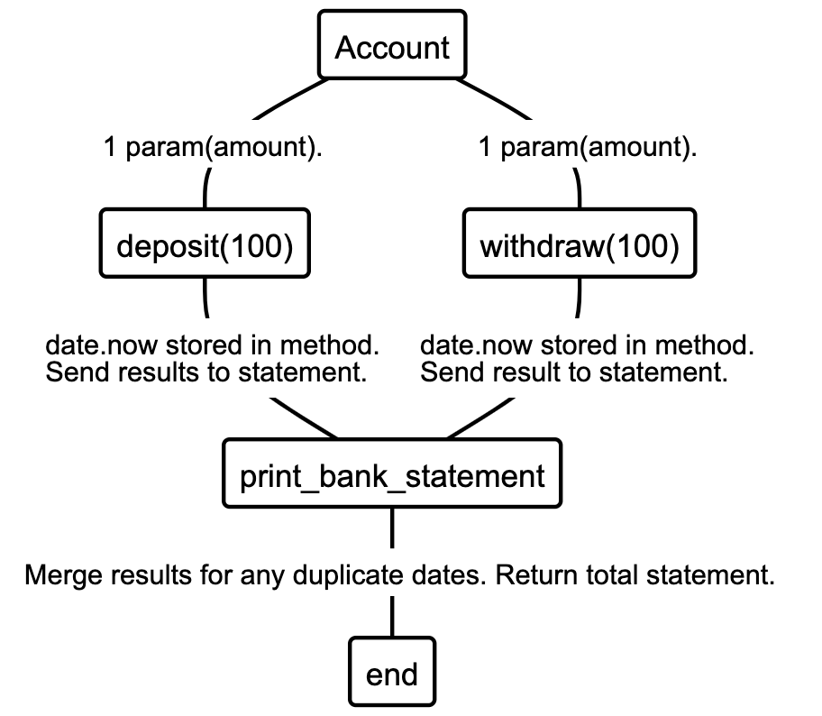

# Bank Tech Test

### Requirements

* You should be able to interact with your code via a REPL like IRB or the JavaScript console.  (You don't need to implement a command line interface that takes input from STDIN.)
* Deposits, withdrawal.
* Account statement (date, amount, balance) printing.
* Data can be kept in memory (it doesn't need to be stored to a database or anything).

### Acceptance criteria

**Given** a client makes a deposit of 1000 on 10-01-2012  
**And** a deposit of 2000 on 13-01-2012  
**And** a withdrawal of 500 on 14-01-2012  
**When** she prints her bank statement  
**Then** she would see

```
date || credit || debit || balance
14/01/2012 || || 500.00 || 2500.00
13/01/2012 || 2000.00 || || 3000.00
10/01/2012 || 1000.00 || || 1000.00
```


# How to use the code:

Set Up:

* Run bundle install to install the gems from within the gemfile.
```
group :test do
  gem 'rspec'
  gem 'rubocop', '0.79.0'
  gem 'simplecov', require: false
  gem 'simplecov-console', require: false
end

```

Running the tests:

* Type rspec in the terminal, within the main Bank_Tech_Test directory.

Running the code:

* Use IRB to run the code - and require './lib/account.rb'.


### Plan:

### User Stories:

```
As a client
So that I can increase my balance,
I would like to deposit funds to my account, on any given date.
```

```
As a client
So I can decrease my balance,
I would like to withdraw funds from my account, on any given date.
```

```
As a client
So I can view my current balance and transactional history,
I would like to print my bank statement in the form of "date || credit || debit || balance"
```

### Very Basic Input and Output Diagram

```

-------------------------------------
     Input      |     Output
-------------------------------------
  Withdrawals   |   Bank Statement (date, amount, balance)
  & Deposits    |

```

### Incorporating Methods

```
-------------------------------------
     Methods     |     Output
-------------------------------------
  withdraw            |   No requirement for an output here - Information passed and displayed in print_bank_statement.
  deposit             |   No requirement for an output here - Information passed and displayed in print_bank_statement.

 print_bank_statement |    date || credit || debit || balance
                            14/01/2012 || || 500.00 || 2500.00
                            13/01/2012 || 2000.00 || || 3000.00
                            10/01/2012 || 1000.00 || || 1000.00  
```              

### Example Input and Output Data

 ```
 ------------------------------------------------
               Input      |     Output
 ------------------------------------------------
    deposit(500)  on 12/06/2020   |  -      
    deposit(150)  on 13/06/2020   |  -
    withdraw(150) on 14/06/2020   |  -
    deposit(1000) on 15/06/2020   |  -
    withdraw(500) on 15/06/2020   |  -
    print_bank_statement          |  date || credit || debit || balance
                                      15/06/2020 || 1000.00|| 500.00 || 1000.00
                                      14/06/2020 || || 150.00 || 500.00
                                      13/06/2020 || 150.00 || || 650.00
                                      12/06/2020 || 500.00 || || 500.00

 ```

### Initial things to take note of based on this plan:

* Numbers are floats, not integers. There is also no use of currency ($ £).
* Date is presented in order of most recent transaction
* Where there is no activity (a debit but no credit), leave the column as NULL(Blank) - do not put zero.
* The dates recorded are only dates where a transaction has taken place.
* Keep note of instances where a client has deposited and withdrawn on the same day, the statement leaves room for this possibility.
* Balance starts at 0.
* For the sake of these requirements and given examples, a client must have sufficient funds to withdraw. You cannot withdraw without
first depositing. There is no indication of using minus numbers in this requirement.
* *date formation of DD/MM/YYYY*
* *credit == deposit*
* *debit == withdrawal*
* *balance == total funds*
* *separated by || (or operator)*


## Diagraming:


